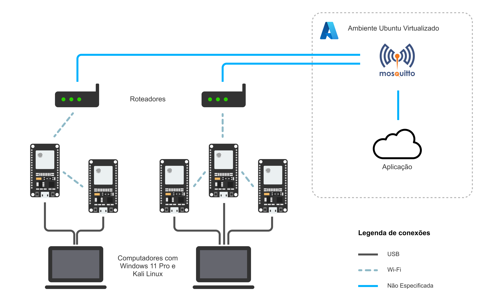

# Segurança em redes MESH para IoT

Esse repositório contém o projeto desenvolvido para o Trabalho de Conclusão de Curso em Segurança da Informação dos alunos da Fatec São Caetano do Sul, sob orientação do Prof. Dr. [Fábio Henrique Cabrini](https://github.com/fabiocabrini).  
  
### Alunos:

- Amanda de Caires Ferreira
- Clara Simone dos Santos
- Francidalva de Sousa Moura
- [Matheus Dominguez Facin](https://github.com/TheusFacin)
- [Matheus Santos de Almeida](https://github.com/MaaSantos45)

## Conteúdo

Este repositório está dividido na seguinte estrutura:

[`v0_comm_test/`](./v0_comm_test/) - Contém o código de teste de comunicação entre os nós  
[`v1_base_code/`](./v1_base_code/) - Contém o código base da aplicação que será utilizada nos testes  
[`v2_mqtt_login/`](./v2_mqtt_login/) - Contém o código do cenário onde login e senha são implementados no MQTT  
[`v3_mqtt_tls/`](./v3_mqtt_tls/) - Contém o código do cenário onde o TLS é implementado no MQTTS  
[`v4_mqtt_tls_mutuo/`](./v4_mqtt_tls_mutuo/) - Contém o código do cenário onde a autenticação dos clientes via certificado é implementada no MQTTS  
[`v5_protected_frames/`](./v5_protected_frames/) - Contém o código do cenário onde o recurso de _Protected Management Frames_ (PMF) é implementado  
[`v6_wpa3/`](./v6_wpa3/) - Contém o código do cenário onde a obrigatoriedade do WPA3 é implementado  
  
[`configs/`](./postman/) - Arquivos de configuração do Docker e Mosquitto para cada cenário  
[`images/`](./images/) - Imagens de apoio e explicações  
[`keys/`](./keys/) - Chaves e certificados utilizados pelo TLS  

> (Importante notar que tais chaves foram utilizadas somente para propósitos de testes, e não estão sendo - **e nem devem ser** - utilizadas em nenhuma aplicação de produção, por isso estão expostas nesse repositório)  

Cada diretório, exceto o `images/` e `keys/` contém seus próprios arquivos `README.md` explicando em detalhes o propósito e utilização do código e arquivos ali presentes.  

Além dos diretórios, existem dois arquivos importantes na raíz do projeto:

[`create_mqtt_env.py`](./create_mqtt_env.py) - Realiza todas as requisições HTTP necessárias para a criação do ambiente de testes do MQTT, Orion e IoT Agent.
[`generate_keys.sh`](./generate_keys.sh) - Gera as chaves e certificados utilizados no TLS.

## Arquitetura do projeto

### ESP32 e ESP-IDF

O ESP32 é um microcontrolador desenvolvido pela Espressif Systems e conta com Wi-Fi e bluetooth integrados, além de funcionalidades que permitem ampla integração em ambientes industriais, dispositivos diversos e aplicativos de IoT.  

Para o desenvolvimento na plataforma ESP32, a Espressif disponibiliza o frameword [ESP-IDF](https://docs.espressif.com/projects/esp-idf/en/latest/esp32/), que conta com uma diversa gama de APIs para a utilização das redes sem fio e dos recursos de hardware do controlador.

### FIWARE

O [FIWARE](https://www.fiware.org/) é um framework de código aberto que disponibiliza padrões para possibilitar o desenvolvimento de soluções IoT de maneira rápida, fácil e acessível.  

Ele define padrões abertos para a interoperabilidade na troca de informações entre diferentes aplicações, e é baseado em serviços e componentes para atuações específicas, chamados de Generic Enabler (GE).

### FIWARE Descomplicado

O [FIWARE Descomplicado](https://github.com/fabiocabrini/fiware/) é uma ferramenta para a instanciação dos principais GEs destinados a operação como back-end para aplicações de IoT com persistência de dados.

Essa ferramenta simplifica o processo de instanciação dos principais GEs e facilita o desenvolvimento de PoCs baseadas no processamento de informações de contexto.

### Orion Context Broker

O [Orion Context Broker](https://fiware-orion.readthedocs.io/en/3.10.1/index.html) é um componente da plataforma FIWARE que realiza a gestão do contexto e das informações armazenadas na solução a ser desenvolvida.

Ele utiliza um modelo de publicação/assinatura por meio de uma API RESTful para fornecer atualizações em tempo real sobre mudanças no contexto das entidades.

### MQTT e IoT-Agent

O [MQTT](https://mqtt.org/) é um protocolo de transmissão de mensagens para dispositivos IoT, desenvolvido como uma implementação leve do modelo de publicação/assinatura, utilizando o mínimo de largura de banda de rede.  

O [IoT-Agent](https://github.com/FIWARE/tutorials.IoT-Agent) é um componente FIWARE que facilita a integração de dispositivos IoT utilizando o protocolo MQTT e permite a comunicação bidirecional desses dispositivos com o Orion Context Broker, transformando as mensagens MQTT em atualizações de contexto compreensívies.
