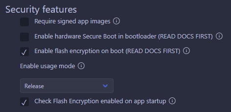

# Criptografia da Memória Flash

Essa é a implementação da sexta e última medida de segurança tomada: Criptografia da Memória Flash.  

## Funcionalidade

Esse programa implementa a criptografia dos dados contidos no chip de memória flash externa do ESP32, impedindo a sua leitura, mesmo com um _dump_ físico da memória.  

### Configuração do dispositivo

O primeiro passo é fazer a criação de uma chave criptográfica a ser utilizada.  

``` bat
python %IDF_PATH%\components\esptool_py\esptool\espsecure.py generate_flash_encryption_key key.bin
```

Em seguida, a chave deve ser enviada ao dispositivo __(_Essa ação é IRREVERSÍVEL_)__.

``` bat
python %IDF_PATH%\components\esptool_py\esptool\espefuse.py --port {PORTA} burn_key flash_encryption key.bin 
```

Duas configurações devem ser alteradas:



Com isso, a criptografia está habilitada e o conteúdo da memória será criptografado na primeira inicialização após o carregamento do programa ao dispositivo.  

Para realizar o carregamento de código após a configuração da criptografia no modo `release`, criptografe o código antes e depois carregue seguindo as instruções em [`Cript_Flash.md`](Cript_Flash.md).  

## Organização do código

`key.bin` - Chave de criptografia da memória flash.  
`Cript_Flash.md` - Instruções para carregamento de firmware criptografado.  
`enc/` - Contém o firmware, bootloader e tabela de partições criptografadas.  
`main/mesh_main.c` - Contém as inicialização do WiFi, mesh e MQTT, as tasks de envio das mensagens MQTT, e a retransmissão de mensagens para a rede externa pelo root.  
`main/mesh_event_handler.c` - Contém o handler dos eventos do esp_mesh.  
`main/mqtt_event_handler.c` - Contém o handler dos eventos do mqtt_client.  
`main/sensor_simulator.c` - Sintetiza os dados dos sensores a serem enviados pelo MQTT.  
`main/mqtt_server.crt` - Certificado do CA para configuração do TLS.
`main/client.crt` - Certificado do cliente para configuração do TLS mútuo.
`main/client.key` - Chave do cliente para configuração do TLS mútuo.
  
`main/include/` - Contém os headers dos arquivos criados, além do header contendo a definição de `mesh_config_t`.

## Arquivos de configuração

`.vscode/` - Configurações do ambiente para o VS Code.  
`CMakeLists.txt` - Informações para o compilador.  
`partitions.csv` - Configuração das partições do ESP32.  
`sdkconfig` - Configurações das variáveis de ambiente.  
  
`main/CMakeLists.txt` - Informações para o compilador.  
`Kconfig.projbuild` - Configurações das variáveis de ambiente.  

## Instalação

1. Seguir as orientações para instalar a [extenção ESP-IDF](https://github.com/espressif/vscode-esp-idf-extension/blob/master/docs/tutorial/install.md) para o VS Code;  
2. Conectar o dispositivo no computador via USB;  
3. Selecionar a porta de comunicação com o dispositivo (`1`);  
4. Selecionar o tipo de placa (`2`);  
5. Compilar o projeto e gerar a pasta `/build` contendo os binários (`3`);  
6. Enviar os binários e as configurações do bootloader para o dispositivo (`4`);  
7. Monitorar o dispositivo e as mensagens de log geradas (`5`);  
`*` - Essa opção é um atalho para os itens `3`, `4` e `5`;  


